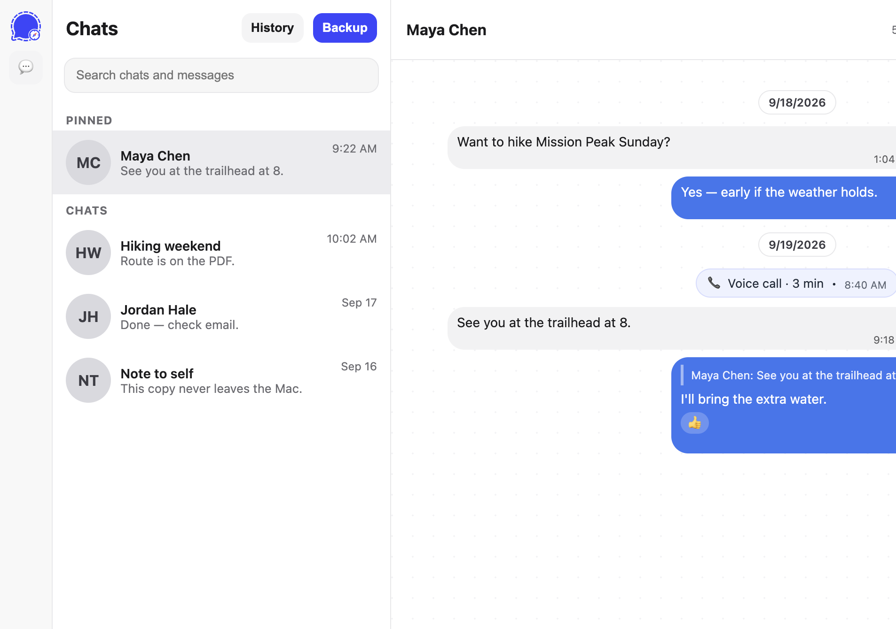
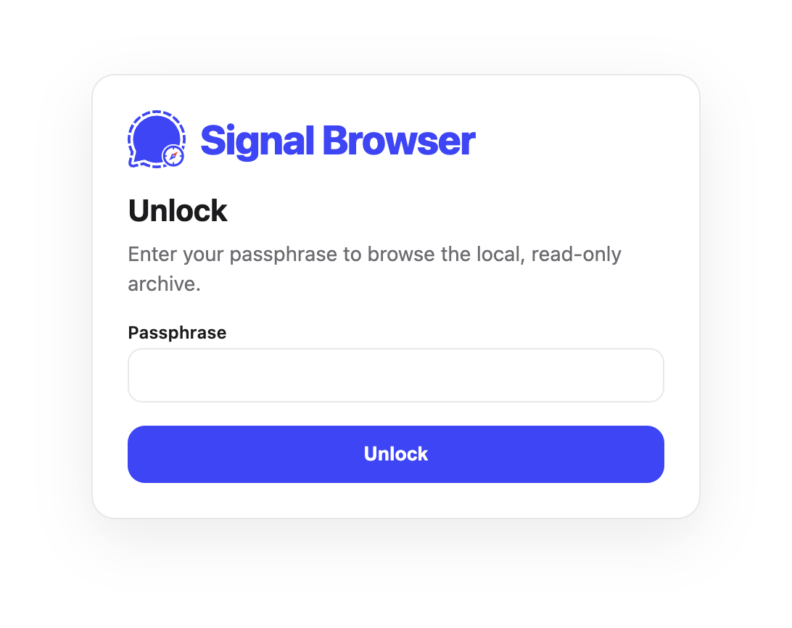
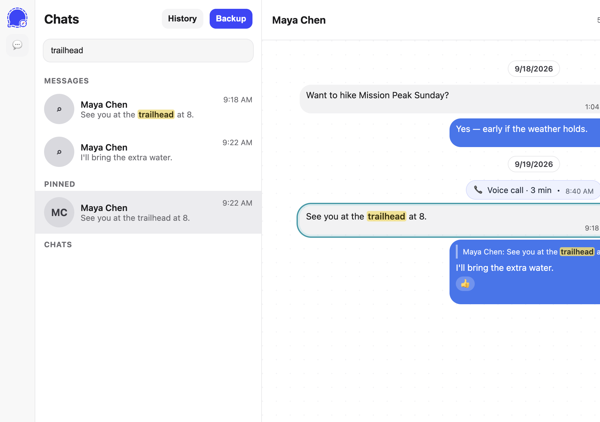
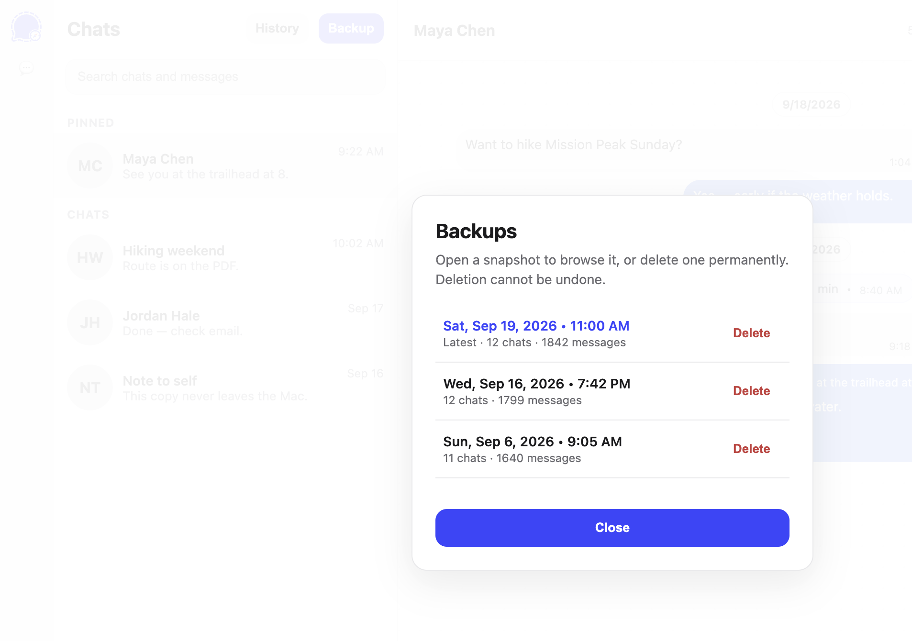

# Signal Browser

**Author:** Leo A. Ramirez Jr. — <leo.ramirez@alumni.stanford.edu>

**Repository:** [github.com/leorami/signal-browser](https://github.com/leorami/signal-browser)

A local, read-only archive of your Signal Desktop chats. It looks like Signal, stays on this computer, and never sends a copy anywhere.

<p align="center">
  
</p>

<p align="center"><em>Fictional sample chats for the screenshot — not a real export.</em></p>

There are two ways to use it:

1. **Signal Browser.app** — passphrase lock, encrypted vault, **Backup**, **History**
2. **Static HTML** — a frozen `index.html` you can open in any browser, with the same chat list, search, and bubbles

---

## On a Mac: no command line

If you already have a built app:

1. Open **`dist/Signal Browser.app`**
2. Drag it to **Applications** if you want it in Launchpad and Spotlight
3. Double-click **Signal Browser**, choose a passphrase, then **Backup**

<p align="center">
  
</p>

Later launches ask for that passphrase — not your Mac password. After 15 minutes idle, or when you close the window, the archive locks again.

That is the whole launch path. You do not need Terminal, `pip`, or Python.

macOS applies its usual rounded-square mask to the Dock icon. The artwork is Signal blue (`#3B45FD`) with an inset white dashed bubble and a small compass.

### Why the app lives in `dist/`, not the repo root

A `.app` bundle is a compiled, machine-specific folder (tens of megabytes, often unsigned). Putting it in git would bloat every clone, go stale whenever the sources change, and be the wrong binary for another Mac architecture.

`dist/` is gitignored. **Ship downloads from GitHub Releases** (zip `Signal Browser.app`) when other people should not have to build. Developers regenerate it with:

```bash
./scripts/package_macos.sh
open "dist/Signal Browser.app"
```

Requires macOS, Python 3.9+, [ImageMagick](https://imagemagick.org/) (`magick`), and [signalbackup-tools](https://github.com/bepaald/signalbackup-tools) for the Desktop dump.

The on-disk vault is `~/Library/Application Support/SignalBrowser/vault`. Set `SIGNAL_BROWSER_HOME` to move it.

---

## What the app can do

| | |
| --- | --- |
| **Backup** | Closes Signal Desktop briefly, copies chats and media into an encrypted vault |
| **Browse** | Read-only threads with avatars, images, video, audio, files, and calls |
| **Search** | Matches names and message text across every conversation |
| **History** | Open an older snapshot; delete one only after a warning you cannot undo |
| **Lock** | Passphrase on launch; auto-lock after 15 minutes idle and when the window closes |

Search across chats uses a muted gold highlight. The selected hit gets a teal ring so you can jump straight to that message.

<p align="center">
  
</p>

**History** lists every snapshot. Open one to browse it, or delete it permanently after a confirmation you cannot undo.

---

## If you replace your phone

This vault is a **local archive**. It is not a Signal restore, and it cannot put old chats back into Signal.

- Relinking Signal Desktop starts a new Desktop database. This app cannot write the vault into that database.
- Linked devices only receive **new** messages from the phone. Desktop history does not propagate to iPhone or other linked instances.
- Official Signal Desktop → phone restore exists for **Android only**, and it uses Signal’s own backup — not this vault. iPhone cannot be filled from Desktop or from Signal Browser.
- After a relink, **Backup** copies whatever live Desktop has *now* (often only new chats) as another snapshot. Older snapshots stay until you delete them.

Keep this vault. Use **History** here to read the chats you already saved. Do **not** overwrite `~/Library/Application Support/Signal` with an old copy: that fights the new link and can brick Desktop.

<p align="center">
  
</p>

---

## Static HTML export

The HTML viewer is the same layout, search, avatars, media, and call chips as the app. It is a single folder: `index.html` plus `assets/`. There is no server, no passphrase, and no live Backup.

**Use HTML** when you want a readable snapshot you can zip, copy to another disk, or open later without Signal Browser.app.

**Use the app** when you want Time Machine-style **History**, an encrypted vault, and one-click **Backup** from live Signal Desktop.

What stays desktop-only:

- Passphrase lock
- Encrypted vault and snapshot delete
- **Backup** from Signal Desktop
- Serving media from encrypted blobs (HTML writes ordinary files under `assets/`)

### Build HTML

```bash
pip install -e .
signal-browser-html --db /path/to/signal_plain.sqlite \
  --src "$HOME/Library/Application Support/Signal/attachments.noindex" \
  --out "$HOME/signal_browser_html"
```

Then open `$HOME/signal_browser_html/index.html`. Helper for power users: `./scripts/signal_browser.sh` (decrypts Desktop with `signalbackup-tools`, then runs the same CLI).

---

## Other platforms

The macOS `.app` is a **PyInstaller** wrapper around the same Python app (`pywebview` + a localhost UI). That pattern does **not** automatically give you every OS.

| Platform | Same approach? | Notes |
| --- | --- | --- |
| **Windows** | Yes, in spirit | PyInstaller can build a windowed `.exe` **on a Windows machine** (or Windows CI). You would add a `.ico`, a Windows spec, and optionally an installer. Cross-compiling from a Mac is not reliable. |
| **Linux** | Yes, in spirit | PyInstaller (or a `.desktop` launcher) on Linux. Same Python code; you still need Signal Desktop’s data directory on that machine. |
| **iOS / iPadOS** | No | PyInstaller and pywebview target desktop. Signal iOS does not use the Desktop database this tool reads. |
| **Android** | No | Not a PyInstaller target. Signal Android’s store is separate from Desktop. |

HTML export already works anywhere you can open a browser. A Windows `.exe` is the realistic next packaged app.

---

## Privacy

- The desktop app listens only on `127.0.0.1`
- Vault is scrypt + AES-GCM
- Snapshot files are overwritten with random bytes before they are removed
- Temporary decrypted files are deleted after each backup
- HTML is a local folder of files you control — do not upload it if the chats are private
- No analytics, no remote assets

---

## From source

Clone the public repo:

```bash
git clone https://github.com/leorami/signal-browser.git
cd signal-browser
```

The Python package is `signal-browser` / `signal_browser`.

### Desktop app without packaging

```bash
pip install -e ".[app]"
signal-browser
```

### Configuration

Precedence: CLI flags > `.env` > process env > defaults.

```
DB=
DB_OUT="$HOME"
SRC="$HOME/Library/Application Support/Signal/attachments.noindex"
HTML_OUT="$HOME/signal_browser_html"
SIGNAL_BROWSER_HOME=   # vault location; default is the OS app-data dir
```

See [docs/TOOLING.md](docs/TOOLING.md) for why `signalbackup-tools` is the dump tool and when `sigtop` is a fallback.

### Tests

```bash
pip install -e ".[dev]"
pytest -q
```

---

## Notes

- All processing is local.
- Attachment decryption is best-effort when keys or files are missing.
- `sigtop` is an optional fallback if `signalbackup-tools` is not installed.
- The in-app logo stays a transparent Signal bubble with a compass. Only the macOS Dock / `.icns` uses the solid blue square.
